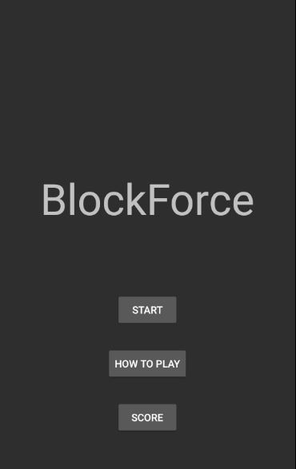
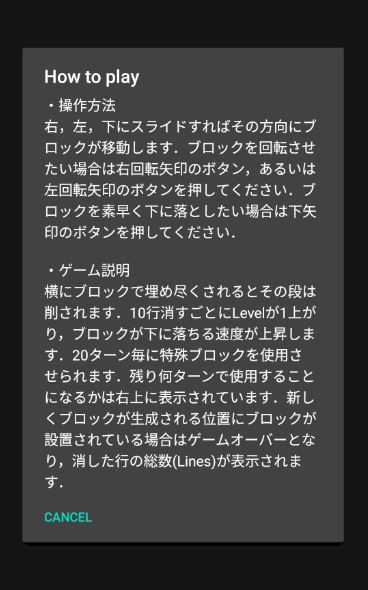
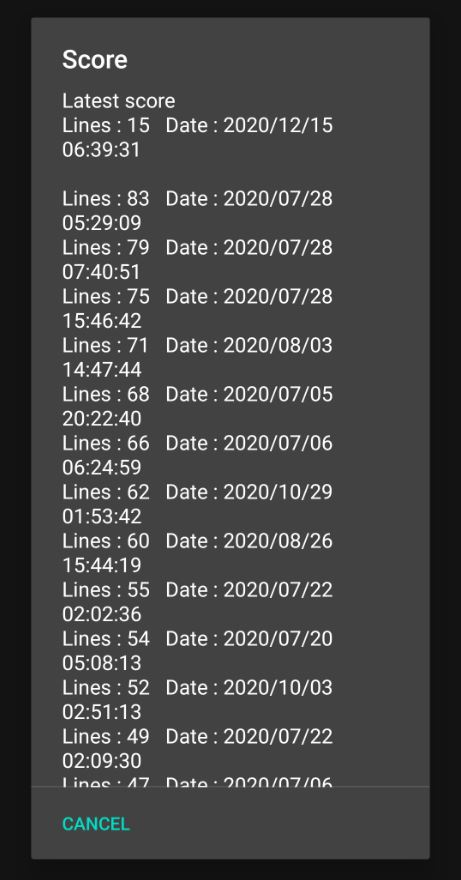
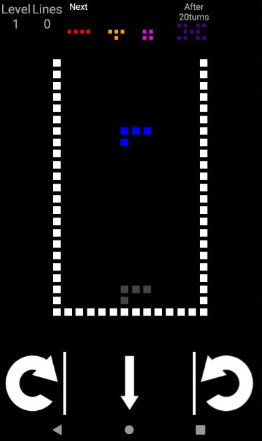
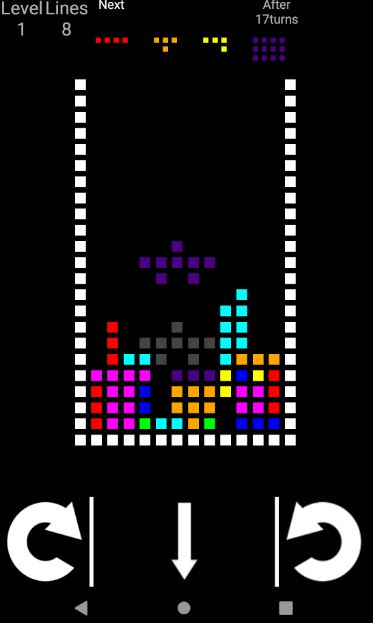

# Androidゲームアプリ「BlockForce」

## ゲーム説明
テトリスを拡張したゲームで，定期的に通常のテトリスにはない形をした特殊なブロックを使わなければならないという制約を与えることでよりゲーム性を高めたゲームです。消した行数が増えるほどブロックが落ちる速度が早くなります。

### ゲームの流れ
起動すると以下のような画面になります。

「START」ボタンはゲームを始めるボタンで、押すとゲーム画面に遷移します。
「HOW TO PLAY」ボタンはゲームの操作、ルール説明がダイアログとして以下のように表示されます。

「SCORE」ボタンは今までに取ったスコア(消した行数)一覧が以下のように表示されます。最新のスコアがLatest scoreとして一番上に表示され、下に降順にソートされたスコアが表示されます。

「START」ボタンを押すと以下のようなゲーム画面に遷移します。

左下の右に回っている矢印ボタンはブロックを右に回転させ、右下の左に回っている矢印ボタンはブロックを左に回転させます。下矢印のボタンはブロックを素早く落とします。

例として、少し遊んだあとの状態の画面を以下に示します。

左上のLevelはブロックが落ちる速さを表しており、1レベルからスタートし、10行消す毎に1レベルあがります。Linesは消した行数の数で、これがスコアになります。この例では8行消しています。Nextの下に並んでいる3つのブロックは次に使用されるブロックが順に表示されており、一番右のブロックは特殊ブロックで、何ターン後に使用させられるかも表示しています。この例では17ターン後に使用されます。

## 使用言語
Java

## 技術
SQLite
